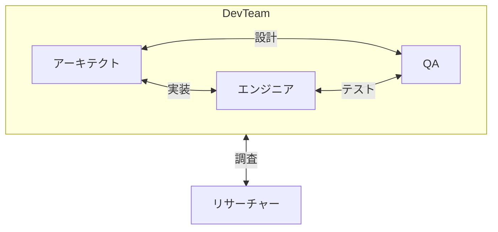
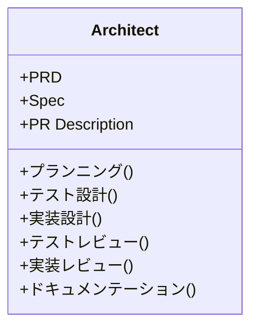
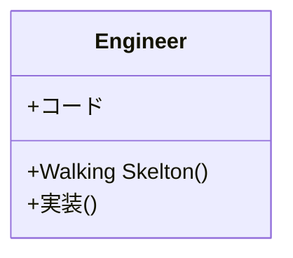
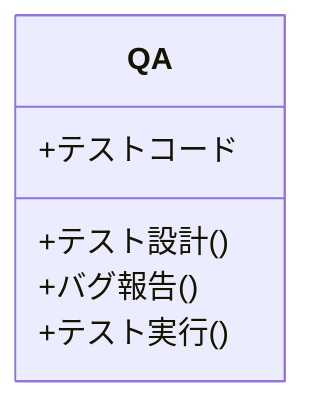
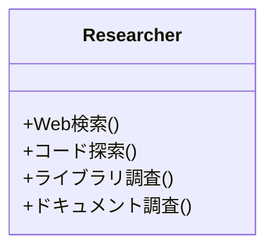

# dev-team rule

```mermaid
graph TD;
	subgraph DevTeam
		アーキテクト <-- 設計 --> QA;
		アーキテクト <-- 実装 --> エンジニア;
		エンジニア <-- テスト --> QA;
	end
DevTeam <-- 調査 --> リサーチャー;
```

```mermaid
classDiagram
    class Architect
    Architect : +PRD
    Architect : +Spec
    Architect : +PR Description
    Architect : +プランニング()
    Architect : +テスト設計()
    Architect : +実装設計()
    Architect : +テストレビュー()
    Architect : +実装レビュー()
    Architect : +ドキュメンテーション()
```

```mermaid
classDiagram
    class Engineer
    Engineer : +コード
    Engineer : +Walking Skelton()
    Engineer : +実装()
```

```mermaid
classDiagram
    class QA
    QA : +テストコード
    QA : +テスト設計()
    QA : +バグ報告()
    QA : +テスト実行()
```

```mermaid
classDiagram
    class Researcher
    Researcher : +Web検索()
    Researcher : +コード探索()
    Researcher : +ライブラリ調査()
    Researcher : +ドキュメント調査()
```
