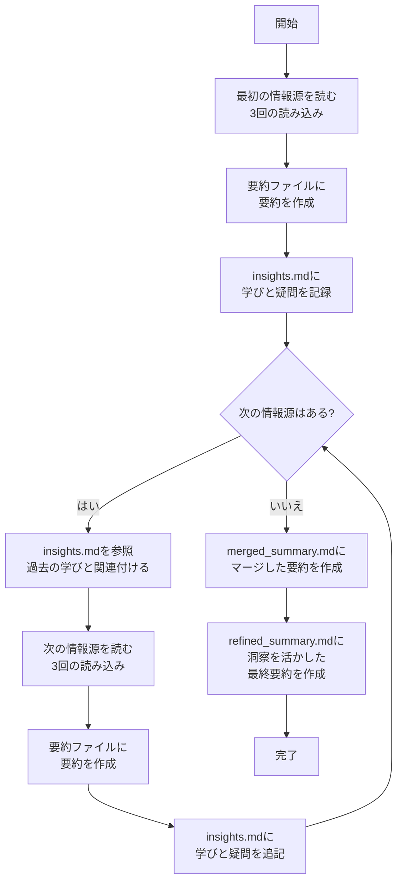

# 要約タスク

## ルール

### 前提

- 要約は常に「ファイルに書き出す」ことが必要です。チャットに出力することは要約とは扱いません。
- 要約の過程で原文と意味合いが変わってしまうことは許容されません。
- 情報源が複数あり互いに矛盾している場合、その矛盾自体も重要な情報として扱ってください。

### 要約プロセスの概要



**重要**: 複数の情報源がある場合、必ず1つの情報源を完全に処理してから次の情報源に進んでください。すべての情報源を一度に読んでから要約するアプローチは避けてください。

正しいプロセスの流れ:
1. 最初の情報源を読む（3回）→ 要約する → 学びを記録する
2. insights.mdを参照 → 次の情報源を読む（3回）→ 要約する → 学びを記録する
3. すべての情報源を要約した後、マージして最終要約を作成する

### 詳細なステップ

#### 1. 情報源の読み込みと要約（各情報源に対して）

1. **複数回の読み込み**：資料を最低3回読み込み、段階的に理解を深める
   - 1回目：全体像の把握
   - 2回目：重要な概念や主張の抽出
   - 3回目：関連性や論理構造の分析

2. **読み込みプロセスの記録**：各読み込みで得た理解や気づきを記録する

3. **要約の構造化**：
   - 主要ポイントの箇条書き
   - 詳細な要約（段落形式）
   - 考察や疑問点

4. **学びと疑問の記録**：「学び」と「疑問」をinsights.mdに記録する

#### 2. insights.mdの参照と活用

次の情報源に進む前に、必ずinsights.mdを参照してください。insights.mdは単なる記録ではなく、要約プロセス全体を通じた学習と理解の深化のためのツールです：

1. **知識の蓄積**：各情報源から得た知見を累積的に記録
2. **次の情報源への橋渡し**：前の情報源から学んだことを次の情報源の理解に活用
3. **パターンの発見**：複数の情報源を横断する概念やテーマを特定
4. **最終要約の強化**：蓄積された洞察を活用して最終要約をより深く、包括的なものにする

#### 3. 複数情報源の統合（すべての情報源を処理した後）

1. マージした要約の作成（merged_summary.md）
2. 洞察を活かした最終要約の作成（refined_summary.md）

### ディレクトリ構造

```
summaries/
  ├── article1_summary.md     # 1つ目の記事の要約
  ├── article2_summary.md     # 2つ目の記事の要約
  ├── article3_summary.md     # 3つ目の記事の要約
  ├── insights.md             # 学びや疑問を記録するファイル
  ├── merged_summary.md       # マージされた要約
  └── refined_summary.md      # 洗練された最終要約
```

各要約ファイル（article*_summary.md）には以下を含める:
1. 記事のタイトルとURL
2. 要約日時
3. 読み込みプロセスの記録
4. 主要ポイント
5. 詳細な要約
6. 考察や疑問点

最終的な洗練要約（refined_summary.md）には以下を含める:
1. 要約対象の全体リスト
2. 要約日時
3. 主要な共通ポイントと相違点
4. 統合された詳細な要約
5. 洞察に基づく考察
