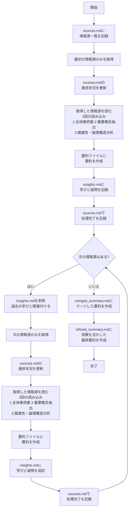

# 要約タスク

## ルール

### 前提

- 要約は常に「ファイルに書き出す」ことが必要です。チャットに出力することは要約とは扱いません。
- 要約の過程で原文と意味合いが変わってしまうことは許容されません。
- 情報源が複数あり互いに矛盾している場合、その矛盾自体も重要な情報として扱ってください。
- **情報源は必ず1つずつ取得し、完全に処理してから次に進んでください。複数の情報源を一度に取得することは厳禁です。**
- **情報源の一覧と進捗状況は`sources.md`ファイルで管理してください。**

### 要約プロセスの概要



**重要**: 複数の情報源がある場合、必ず1つの情報源を完全に処理してから次の情報源に進んでください。すべての情報源を一度に読んでから要約するアプローチは避けてください。情報源のURLや内容を一括で取得することは厳禁です。

**誤った例**:
- 最初に全ての記事のURLを一括で取得してから処理する
- 複数の記事の内容を同時に取得して比較する

**正しい例**:
- 最初の記事のURLのみを取得し、その記事を完全に処理（読み込み→要約→学びの記録）した後に次の記事のURLを取得する
- 各記事の処理が完了したことを確認してから次のステップに進む

正しいプロセスの流れ:
1. 情報源一覧を`sources.md`に記録する
2. 最初の情報源のみを取得し、`sources.md`の進捗状況を更新 → 読む（3回：①全体像把握、②重要概念抽出、③関連性・論理構造分析）→ 要約する → 学びを記録する → 処理完了を記録
3. insights.mdを参照 → 次の情報源のみを取得し、`sources.md`の進捗状況を更新 → 読む（3回：①全体像把握、②重要概念抽出、③関連性・論理構造分析）→ 要約する → 学びを記録する → 処理完了を記録
4. すべての情報源を要約した後、マージして最終要約を作成する

### sources.mdの構造

`sources.md`ファイルは単純なチェックリスト形式で、以下のような内容を含めてください：

```
# 情報源一覧と進捗状況

- [x] [記事1のタイトル](URL1)
- [x] [記事2のタイトル](URL2)
- [ ] [記事3のタイトル](URL3)
```

処理が完了したら `- [x]` に更新してください。

### 情報源の参照形式

各要約ファイルには情報源をシンプルに記載してください：
- 個別記事：`# [タイトル](URL)`
- 複数記事：番号付きリストで `1. [タイトル](URL)`

### ディレクトリ構造

```
summaries/
  ├── sources.md              # 情報源一覧と進捗状況の管理ファイル
  ├── article1_summary.md     # 1つ目の記事の要約
  ├── article2_summary.md     # 2つ目の記事の要約
  ├── article3_summary.md     # 3つ目の記事の要約
  ├── insights.md             # 学びや疑問を記録するファイル
  ├── merged_summary.md       # マージされた要約
  └── refined_summary.md      # 洗練された最終要約
```
